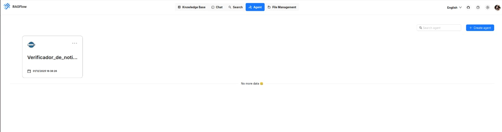

---
hide:
  - navigation
  - toc
---

<h1 class="hero-title">A Verdade, Verificada por IA.</h1>

    O <strong>Eh Fake</strong> combina o poder dos LLMs com a precisão da busca vetorial (RAG) para desmascarar desinformação em segundos. Open Source, rápido e confiável.

    <a href="documentacao/comece_aqui" class="md-button md-button--primary md-button--large">
        Começar Agora ⚡
    </a>
    <a href="https://github.com/unb-mds/2025-2-Eh_Fake" class="md-button md-button--secondary md-button--large">
        Ver no GitHub
    </a>

    
    <input type="radio" name="slider" id="slide1" checked>
    <input type="radio" name="slider" id="slide2">

    

        

            
            

                
            

            

                
            

        

    

    

        <label for="slide1" class="prev-btn">❮</label>
        <label for="slide2" class="next-btn">❯</label>
    

    

        <label for="slide1" class="nav-dot"></label>
        <label for="slide2" class="nav-dot"></label>
    

    
Desenvolvido com Tecnologias Modernas

    
    

        
        
        
        
        
        
        
        
        
        
        
    

<h2 class="section-title">Por que o Eh Fake é diferente?</h2>

Tecnologia projetada para transparência e precisão.

-   :material-brain: **RAG Avançado (RagFlow)**
    ---
    Utilizamos *Retrieval-Augmented Generation* para cruzar a notícia suspeita com uma base de conhecimento confiável antes de gerar o veredito, reduzindo alucinações.

-   :material-web: **Busca Híbrida na Web**
    ---
    Além da base interna, nossa IA realiza pesquisas em tempo real na internet (Web Search) para validar fatos muito recentes que ainda não foram catalogados.

-   :material-database-search: **Coleta Controlada**
    ---
    Nosso **Minerador** varre fontes oficiais e jornalísticas de forma automatizada quando acionado, garantindo que o banco de dados receba apenas dados relevantes e curados.

-   :material-text-box-check: **Análise Fundamentada**
    ---
    O veredito não é um palpite. A IA realiza uma verificação lógica complexa nos bastidores, cruzando evidências para garantir que a classificação (Real/Fake) seja tecnicamente precisa.

-   :material-palette-swatch: **UX Moderna & Acessível**
    ---
    Interface desenvolvida em Next.js com suporte nativo a Tema Escuro/Claro e paginação otimizada, garantindo acessibilidade e conforto visual.

-   :material-docker: **Arquitetura Modular**
    ---
    Sistema conteinerizado e desacoplado. O Front-end, o Banco de Dados e o Motor de IA operam de forma independente, facilitando escalabilidade e manutenção.

<h2 class="section-title">Como Funciona</h2>

Nossa arquitetura combina mineração de dados contínua com a capacidade analítica de LLMs.

-   :material-spider-web: **1. Coleta e Indexação**
    ---
    Nosso **Minerador** extrai notícias de portais confiáveis de forma massiva. O **RagFlow** processa esses textos, transformando-os em vetores matemáticos para nosso banco de dados.

-   :material-magnify-scan: **2. Recuperação de Contexto (RAG)**
    ---
    Quando você envia uma notícia, o sistema busca fatos semelhantes na nossa base vetorial e realiza uma **Web Search** em tempo real para cobrir eventos de última hora.

-   :material-robot-happy: **3. Análise e Veredito**
    ---
    O **Google Gemini** recebe sua notícia + o contexto recuperado (fatos reais). Ele analisa as contradições internamente e gera um veredito validado pelas fontes encontradas.

<input type="radio" name="schema-slider" id="schema-slide1" checked>
<input type="radio" name="schema-slider" id="schema-slide2">
<input type="radio" name="schema-slider" id="schema-slide3">

<label for="schema-slide3" class="prev-btn">❮</label>
<label for="schema-slide1" class="prev-btn">❮</label>
<label for="schema-slide2" class="prev-btn">❮</label>
<label for="schema-slide2" class="next-btn">❯</label>
<label for="schema-slide3" class="next-btn">❯</label>
<label for="schema-slide1" class="next-btn">❯</label>

<label for="schema-slide1" class="nav-dot"></label>
<label for="schema-slide2" class="nav-dot"></label>
<label for="schema-slide3" class="nav-dot"></label>

 <h3 style="font-size: 1.8rem; font-weight: 700; margin-bottom: 15px;">Pronto para colaborar?</h3> 
O código é aberto e precisamos de contribuidores.
 <a href="equipe" class="md-button md-button--primary md-button--large">Conheça a Equipe</a> 
 